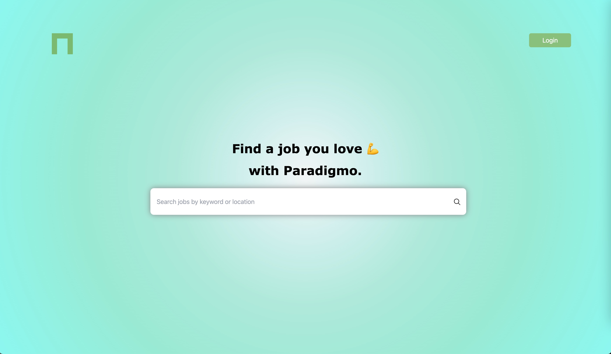
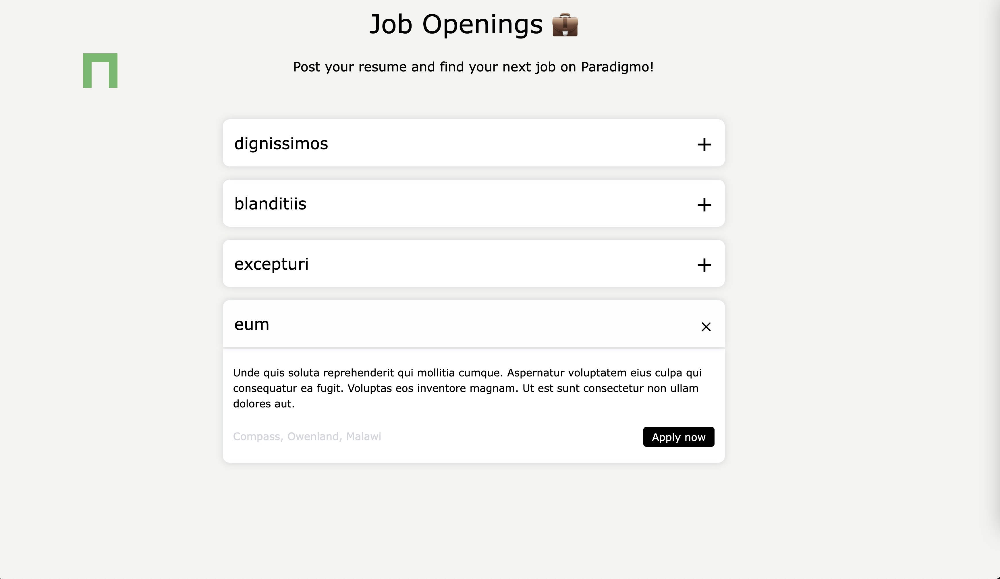
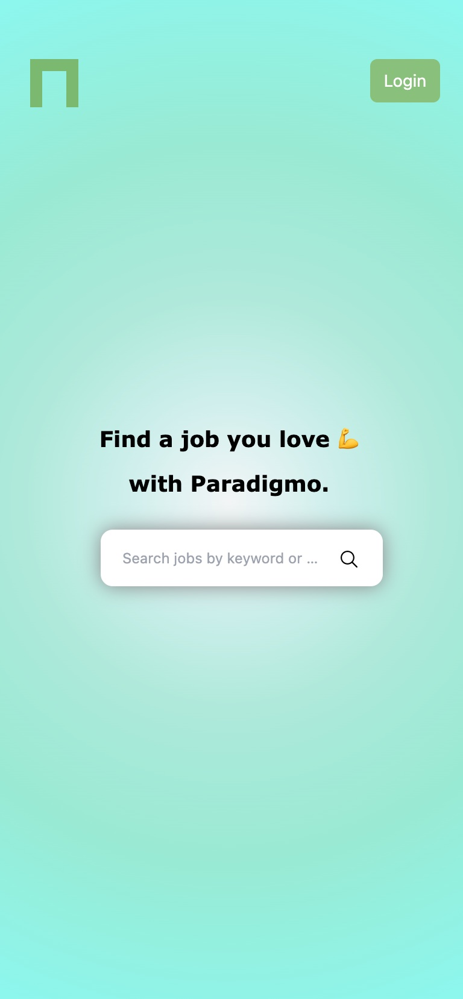
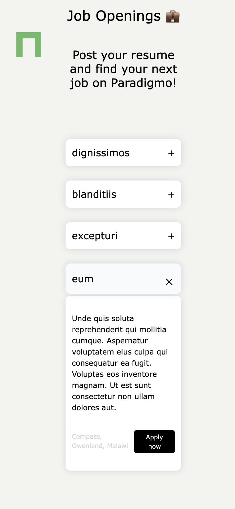

This is a **Job Search Website Demo Project** based on [Next.js](https://nextjs.org/) technology.

## Getting Started

First, run the development server:

```
npm run dev
# or
yarn dev
```

Open [http://localhost:3000](http://localhost:3000/) with your browser to see the result.

You can start editing the page by modifying `pages/index.tsx`. The page auto-updates as you edit the file.

[API routes](https://nextjs.org/docs/api-routes/introduction) can be accessed on http://localhost:3000/api/hello. This endpoint can be edited in `pages/api/hello.ts`.

The `pages/api` directory is mapped to `/api/*`. Files in this directory are treated as [API routes](https://nextjs.org/docs/api-routes/introduction) instead of React pages.

If you want to check the UI document, feel free to use storybook to check it:

```
npm run storybook
```

## Some Screenshots

### Web PC





### Mobile Device





## Deploy on Vercel

The easiest way to show this Next.js app is to use the [Vercel Platform](https://vercel.com/new?utm_medium=default-template&filter=next.js&utm_source=create-next-app&utm_campaign=create-next-app-readme) from the creators of Next.js.

Here is the online website demo link: https://paradigmo-job-search-app.vercel.app/. Please feel free to check it.